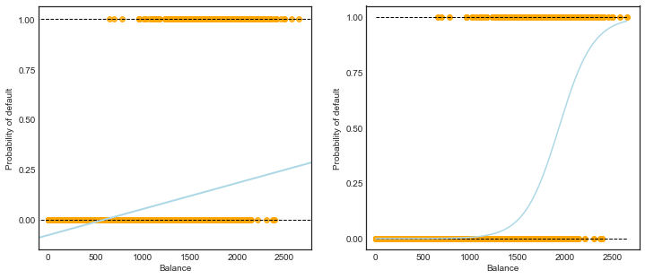
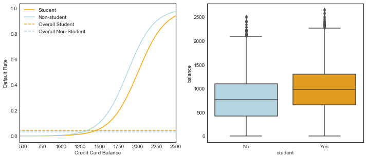
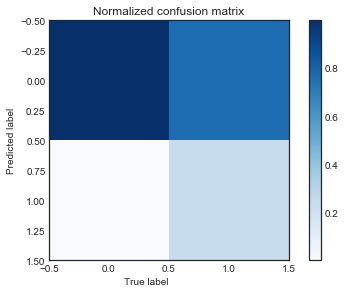
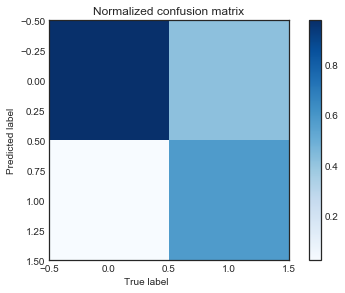
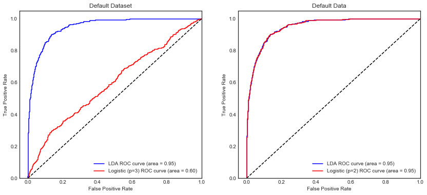

- [Load dataset](#Load-dataset)
- [The Default data set](#Figure-4.1---Default-data-set)
- [4.3 Logistic Regression](#4.3-Logistic-Regression)
- [4.4 Linear Discriminant Analysis](#4.4-Linear-Discriminant-Analysis)

# Chapter 4 - Classification


```python
# %load ../standard_import.txt
import pandas as pd
import numpy as np
import matplotlib as mpl
import matplotlib.pyplot as plt
import seaborn as sns

import sklearn.linear_model as skl_lm
from sklearn.discriminant_analysis import LinearDiscriminantAnalysis
from sklearn.discriminant_analysis import QuadraticDiscriminantAnalysis
from sklearn.metrics import confusion_matrix, classification_report, precision_score, roc_curve, auc
from sklearn import preprocessing
from sklearn import neighbors

import statsmodels.api as sm
import statsmodels.formula.api as smf

pd.set_option('display.notebook_repr_html', False)

%matplotlib inline
plt.style.use('seaborn-white')
```

    /Users/yuany/anaconda3/lib/python3.6/site-packages/statsmodels/compat/pandas.py:56: FutureWarning: The pandas.core.datetools module is deprecated and will be removed in a future version. Please use the pandas.tseries module instead.
      from pandas.core import datetools


### Load dataset


```python
# In R, I exported the dataset from package 'ISLR' to an Excel file
df = pd.read_excel('Data/Default.xlsx')

# Note: factorize() returns two objects: a label array and an array with the unique values.
# We are only interested in the first object. 
df['default2'] = df.default.factorize()[0]
df['student2'] = df.student.factorize()[0]
df.head(3)
```


      default student      balance        income  default2  student2
    1      No      No   729.526495  44361.625074         0         0
    2      No     Yes   817.180407  12106.134700         0         1
    3      No      No  1073.549164  31767.138947         0         0


## 4.3 Logistic Regression
### Figure 4.2


```python
X_train = df.balance.values.reshape(-1,1) 
y = df.default2

# Create array of test data. Calculate the classification probability
# and predicted classification.
X_test = np.arange(df.balance.min(), df.balance.max()).reshape(-1,1)

clf = skl_lm.LogisticRegression(solver='newton-cg')
clf.fit(X_train,y)
prob = clf.predict_proba(X_test)

fig, (ax1, ax2) = plt.subplots(1,2, figsize=(12,5))
# Left plot: Linear Regression
sns.regplot(df.balance, df.default2, order=1, ci=None,
            scatter_kws={'color':'orange'},
            line_kws={'color':'lightblue', 'lw':2}, ax=ax1)
# Right plot: Logistic Regression
ax2.scatter(X_train, y, color='orange')
ax2.plot(X_test, prob[:,1], color='lightblue')

for ax in fig.axes:
    ax.hlines(1, xmin=ax.xaxis.get_data_interval()[0],
              xmax=ax.xaxis.get_data_interval()[1], linestyles='dashed', lw=1)
    ax.hlines(0, xmin=ax.xaxis.get_data_interval()[0],
              xmax=ax.xaxis.get_data_interval()[1], linestyles='dashed', lw=1)
    ax.set_ylabel('Probability of default')
    ax.set_xlabel('Balance')
    ax.set_yticks([0, 0.25, 0.5, 0.75, 1.])
    ax.set_xlim(xmin=-100)
```





### Table 4.1


```python
y = df.default2
```

#####  scikit-learn


```python
# Using newton-cg solver, the coefficients are equal/closest to the ones in the book. 
# I do not know the details on the differences between the solvers.
clf = skl_lm.LogisticRegression(solver='newton-cg')
X_train = df.balance.values.reshape(-1,1)
clf.fit(X_train,y)
print(clf)
print('classes: ',clf.classes_)
print('coefficients: ',clf.coef_)
print('intercept :', clf.intercept_)
```

    LogisticRegression(C=1.0, class_weight=None, dual=False, fit_intercept=True,
              intercept_scaling=1, max_iter=100, multi_class='ovr', n_jobs=1,
              penalty='l2', random_state=None, solver='newton-cg', tol=0.0001,
              verbose=0, warm_start=False)
    classes:  [0 1]
    coefficients:  [[ 0.00549891]]
    intercept : [-10.65131887]


##### statsmodels


```python
X_train = sm.add_constant(df.balance)
est = smf.Logit(y.ravel(), X_train).fit()
est.summary().tables[1]
```

    Optimization terminated successfully.
             Current function value: 0.079823
             Iterations 10


<table class="simpletable">
<tr>
     <td></td>        <th>coef</th>     <th>std err</th>      <th>z</th>      <th>P>|z|</th>  <th>[0.025</th>    <th>0.975]</th>  
</tr>
<tr>
  <th>const</th>   <td>  -10.6513</td> <td>    0.361</td> <td>  -29.491</td> <td> 0.000</td> <td>  -11.359</td> <td>   -9.943</td>
</tr>
<tr>
  <th>balance</th> <td>    0.0055</td> <td>    0.000</td> <td>   24.952</td> <td> 0.000</td> <td>    0.005</td> <td>    0.006</td>
</tr>
</table>


###  Table 4.2


```python
X_train = sm.add_constant(df.student2)
y = df.default2

est = smf.Logit(y, X_train).fit()
est.summary().tables[1]
```

    Optimization terminated successfully.
             Current function value: 0.145434
             Iterations 7


<table class="simpletable">
<tr>
      <td></td>        <th>coef</th>     <th>std err</th>      <th>z</th>      <th>P>|z|</th>  <th>[0.025</th>    <th>0.975]</th>  
</tr>
<tr>
  <th>const</th>    <td>   -3.5041</td> <td>    0.071</td> <td>  -49.554</td> <td> 0.000</td> <td>   -3.643</td> <td>   -3.366</td>
</tr>
<tr>
  <th>student2</th> <td>    0.4049</td> <td>    0.115</td> <td>    3.520</td> <td> 0.000</td> <td>    0.179</td> <td>    0.630</td>
</tr>
</table>


###  Table 4.3 - Multiple Logistic Regression


```python
X_train = sm.add_constant(df[['balance', 'income', 'student2']])
est = smf.Logit(y, X_train).fit()
est.summary().tables[1]
```

    Optimization terminated successfully.
             Current function value: 0.078577
             Iterations 10


<table class="simpletable">
<tr>
      <td></td>        <th>coef</th>     <th>std err</th>      <th>z</th>      <th>P>|z|</th>  <th>[0.025</th>    <th>0.975]</th>  
</tr>
<tr>
  <th>const</th>    <td>  -10.8690</td> <td>    0.492</td> <td>  -22.079</td> <td> 0.000</td> <td>  -11.834</td> <td>   -9.904</td>
</tr>
<tr>
  <th>balance</th>  <td>    0.0057</td> <td>    0.000</td> <td>   24.737</td> <td> 0.000</td> <td>    0.005</td> <td>    0.006</td>
</tr>
<tr>
  <th>income</th>   <td> 3.033e-06</td> <td>  8.2e-06</td> <td>    0.370</td> <td> 0.712</td> <td> -1.3e-05</td> <td> 1.91e-05</td>
</tr>
<tr>
  <th>student2</th> <td>   -0.6468</td> <td>    0.236</td> <td>   -2.738</td> <td> 0.006</td> <td>   -1.110</td> <td>   -0.184</td>
</tr>
</table>


### Figure 4.3 - Confounding


```python
# balance and default vectors for students
X_train = df[df.student == 'Yes'].balance.values.reshape(df[df.student == 'Yes'].balance.size,1) 
y = df[df.student == 'Yes'].default2

# balance and default vectors for non-students
X_train2 = df[df.student == 'No'].balance.values.reshape(df[df.student == 'No'].balance.size,1) 
y2 = df[df.student == 'No'].default2

# Vector with balance values for plotting
X_test = np.arange(df.balance.min(), df.balance.max()).reshape(-1,1)

clf = skl_lm.LogisticRegression(solver='newton-cg')
clf2 = skl_lm.LogisticRegression(solver='newton-cg')

clf.fit(X_train,y)
clf2.fit(X_train2,y2)

prob = clf.predict_proba(X_test)
prob2 = clf2.predict_proba(X_test)
```


```python
df.groupby(['student','default']).size().unstack('default')
```


    default    No  Yes
    student           
    No       6850  206
    Yes      2817  127


```python
# creating plot
fig, (ax1, ax2) = plt.subplots(1,2, figsize=(12,5))

# Left plot
ax1.plot(X_test, pd.DataFrame(prob)[1], color='orange', label='Student')
ax1.plot(X_test, pd.DataFrame(prob2)[1], color='lightblue', label='Non-student')
ax1.hlines(127/2817, colors='orange', label='Overall Student',
           xmin=ax1.xaxis.get_data_interval()[0],
           xmax=ax1.xaxis.get_data_interval()[1], linestyles='dashed')
ax1.hlines(206/6850, colors='lightblue', label='Overall Non-Student',
           xmin=ax1.xaxis.get_data_interval()[0],
           xmax=ax1.xaxis.get_data_interval()[1], linestyles='dashed')
ax1.set_ylabel('Default Rate')
ax1.set_xlabel('Credit Card Balance')
ax1.set_yticks([0, 0.2, 0.4, 0.6, 0.8, 1.])
ax1.set_xlim(450,2500)
ax1.legend(loc=2)

c_palette = {'No':'lightblue', 'Yes':'orange'}

# Right plot
sns.boxplot('student', 'balance', data=df, orient='v', ax=ax2,  palette=c_palette);
```





## 4.4 Linear Discriminant Analysis
### Table 4.4 


```python
X = df[['balance', 'income', 'student2']].as_matrix()
y = df.default2.as_matrix()

lda = LinearDiscriminantAnalysis(solver='svd')
y_pred = lda.fit(X, y).predict(X)

df_ = pd.DataFrame({'True default status': y,
                    'Predicted default status': y_pred})
df_.replace(to_replace={0:'No', 1:'Yes'}, inplace=True)

df_.groupby(['Predicted default status','True default status']).size().unstack('True default status')
```


    True default status         No  Yes
    Predicted default status           
    No                        9645  254
    Yes                         22   79


That stands for [['TN', 'FN'],['FP','TP']].


```python
# Show confusion_matrix 
cm = confusion_matrix(y, y_pred)
print(cm.T)
```

    [[9645  254]
     [  22   79]]


```python
def plot_confusion_matrix(cm, title='Confusion matrix (Normalized)',
                          cmap=plt.cm.Blues):
    plt.imshow(cm, interpolation='nearest', cmap=plt.cm.Blues)
    plt.title('Normalized confusion matrix')
    plt.colorbar()
    plt.tight_layout()
    plt.xlabel('True label',rotation='horizontal', ha='right')
    plt.ylabel('Predicted label')
    plt.show()
```


```python
cm = confusion_matrix(y, y_pred)
cm_normalized = cm.astype('float') / cm.sum(axis=1)[:, np.newaxis]
plot_confusion_matrix(cm_normalized.T)
```





```python
print(classification_report(y, y_pred, target_names=['No', 'Yes'], digits=3))
```

                 precision    recall  f1-score   support
    
             No      0.974     0.998     0.986      9667
            Yes      0.782     0.237     0.364       333
    
    avg / total      0.968     0.972     0.965     10000
    


where 
- precision = 1 -  false discovery rate = TP/P* = TP/(TP+FP)
- recall = sensitivity = power = 1 - Type II error = TP/P = TP/(TP+FN)
- [f1-score = 2*((precision*recall)/(precision+recall))](# https://en.wikipedia.org/wiki/F1_score)

### Table 4.5
Instead of using the probability of 50% as decision boundary, we say that a probability of default of 20% is to be classified as 'Yes'.


```python
decision_prob = 0.2
y_prob = lda.fit(X, y).predict_proba(X)

df_ = pd.DataFrame({'True default status': y,
                    'Predicted default status': y_prob[:,1] > decision_prob})
df_.replace(to_replace={0:'No', 1:'Yes', 'True':'Yes', 'False':'No'}, inplace=True)

df_.groupby(['Predicted default status','True default status']).size().unstack('True default status')
```


    True default status         No  Yes
    Predicted default status           
    No                        9435  140
    Yes                        232  193


```python
# Check confusion matrix 
cm = confusion_matrix(y, y_prob[:,1] > decision_prob)
print(cm.T)
```

    [[9435  140]
     [ 232  193]]


```python
cm_normalized = cm.astype('float') / cm.sum(axis=1)[:, np.newaxis]
plot_confusion_matrix(cm_normalized.T)
```





```python
print(classification_report(y, y_prob[:,1] > decision_prob, target_names=['No', 'Yes'], digits=3))
```

                 precision    recall  f1-score   support
    
             No      0.985     0.976     0.981      9667
            Yes      0.454     0.580     0.509       333
    
    avg / total      0.968     0.963     0.965     10000
    


### Logistic Regression with scikit-learn


```python
regr = skl_lm.LogisticRegression()
regr.fit(X, y)
```


    LogisticRegression(C=1.0, class_weight=None, dual=False, fit_intercept=True,
              intercept_scaling=1, max_iter=100, multi_class='ovr', n_jobs=1,
              penalty='l2', random_state=None, solver='liblinear', tol=0.0001,
              verbose=0, warm_start=False)


```python
pred = regr.predict(X)
cm_log = confusion_matrix(y, pred)
cm_df = pd.DataFrame(cm_log.T, index=regr.classes_,
                     columns=regr.classes_)
cm_df.index.name = 'Predicted'
cm_df.columns.name = 'True'
print(cm_df)
```

    True          0    1
    Predicted           
    0          9664  333
    1             3    0


```python
pred_p = regr.predict_proba(X)
cm_df = pd.DataFrame({'True': y, 'Pred': pred_p[:,1] > .25})
cm_df.Pred.replace(to_replace={True:'Yes', False:'No'}, inplace=True)
print(cm_df.groupby(['True', 'Pred']).size().unstack('True').T)
print(classification_report(y, pred_p[:,1] > .25))
```

    Pred    No  Yes
    True           
    0     9371  296
    1      306   27
                 precision    recall  f1-score   support
    
              0       0.97      0.97      0.97      9667
              1       0.08      0.08      0.08       333
    
    avg / total       0.94      0.94      0.94     10000
    


```python
# Remove the 'income' predictor
X = df[['balance', 'student2']].as_matrix()
y = df.default2.as_matrix()

regr.fit(X, y)
```


    LogisticRegression(C=1.0, class_weight=None, dual=False, fit_intercept=True,
              intercept_scaling=1, max_iter=100, multi_class='ovr', n_jobs=1,
              penalty='l2', random_state=None, solver='liblinear', tol=0.0001,
              verbose=0, warm_start=False)


```python
pred2 = regr.predict(X)
cm_log = confusion_matrix(y, pred2)
cm_df = pd.DataFrame(cm_log.T, index=regr.classes_,
                     columns=regr.classes_)
cm_df.index.name = 'Predicted'
cm_df.columns.name = 'True'
print(cm_df)
```

    True          0    1
    Predicted           
    0          9639  243
    1            28   90


```python
pred_p2 = regr.predict_proba(X)
cm_df = pd.DataFrame({'True': y, 'Pred': pred_p2[:,1] > .25})
cm_df.Pred.replace(to_replace={True:'Yes', False:'No'}, inplace=True)
print(cm_df.groupby(['True', 'Pred']).size().unstack('True').T)
print(classification_report(y, pred_p2[:,1] > .25))
```

    Pred    No  Yes
    True           
    0     9490  177
    1      155  178
                 precision    recall  f1-score   support
    
              0       0.98      0.98      0.98      9667
              1       0.50      0.53      0.52       333
    
    avg / total       0.97      0.97      0.97     10000
    


```python
### ROC Curves 
```


```python
# ROC curve of LDA
false_pos_rate1, true_pos_rate1, _ = roc_curve(y, y_prob[:,1])
roc_auc1 = auc(false_pos_rate1, true_pos_rate1)

# ROC curve of Logistic Regression with 3 predictors
false_pos_rate2, true_pos_rate2, _ = roc_curve(y, pred_p[:,1])
roc_auc2 = auc(false_pos_rate2, true_pos_rate2)

# ROC curve of Logistic Regression with 2 predictors
false_pos_rate3, true_pos_rate3, _ = roc_curve(y, pred_p2[:,1])
roc_auc3 = auc(false_pos_rate3, true_pos_rate3)

fig, (ax1,ax2) = plt.subplots(1, 2, figsize=(14,6))
ax1.plot(false_pos_rate1, true_pos_rate1, label='LDA ROC curve (area = %0.2f)' % roc_auc1, color='b')
ax1.plot(false_pos_rate2, true_pos_rate2, label='Logistic (p=3) ROC curve (area = %0.2f)' % roc_auc2, color='r')
ax1.set_title('Default Dataset')

ax2.plot(false_pos_rate1, true_pos_rate1, label='LDA ROC curve (area = %0.2f)' % roc_auc1, color='b')
ax2.plot(false_pos_rate3, true_pos_rate3, label='Logistic (p=2) ROC curve (area = %0.2f)' % roc_auc3, color='r')
ax2.set_title('Default Data')

for ax in fig.axes:
    ax.plot([0, 1], [0, 1], 'k--')
    ax.set_xlim([-0.05, 1.0])
    ax.set_ylim([0.0, 1.05])
    ax.set_xlabel('False Positive Rate')
    ax.set_ylabel('True Positive Rate')
    ax.legend(loc="lower right")
```




